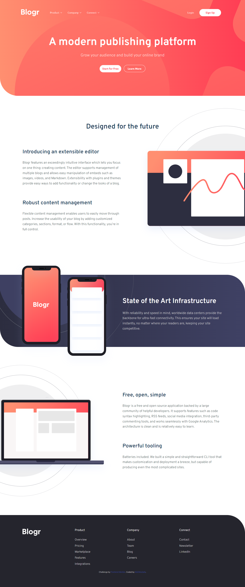
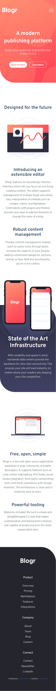
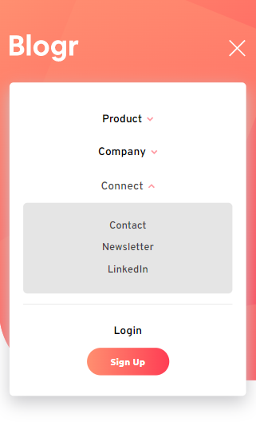

# Frontend Mentor - Blogr landing page solution

This is a solution to the [Blogr landing page challenge on Frontend Mentor](https://www.frontendmentor.io/challenges/blogr-landing-page-EX2RLAApP). Frontend Mentor challenges help you improve your coding skills by building realistic projects. 

## Table of contents

- [Overview](#overview)
  - [The challenge](#the-challenge)
  - [Screenshot](#screenshot)
  - [Links](#links)
- [My process](#my-process)
  - [Built with](#built-with)
  - [What I learned](#what-i-learned)
  - [Continued development](#continued-development)
  - [Useful resources](#useful-resources)
- [Author](#author)

## Overview

### The challenge

Users should be able to:

- View the optimal layout for the site depending on their device's screen size
- See hover states for all interactive elements on the page

### Screenshot





### Links

- Solution URL: [Blogr Landing Page Frontend Mentor Solution](https://github.com/MohMostafa-Web/blogr-landing-page-frontend-mentor)
- Live Site URL: [Blogr Landing Page Live Site](https://mohmostafa-web.github.io/blogr-landing-page-frontend-mentor/)

## My process

### Built with

- Semantic HTML5 markup [header, nav, section]
- Sass custom properties [Varaibles, Mixins , Media Queries, Components]
- Flexbox
- Pure JS

### What I learned

- Create a customized nav menu with dropdown list submenu, see code below:

```html
<nav>
  
  
  <div class="menus">
    <ul class="main-menu">
      <li id="product" class="dropdown-list">
        <div class="title">
          <span>Product</span>
          <svg xmlns="http://www.w3.org/2000/svg" width="10" height="7">
            <path fill="none" stroke="#FFF" stroke-width="2" opacity=".75" d="M1 1l4 4 4-4" />
          </svg>
        </div>
        <ul class="sub-menu">
          <li><a href="#">Overview</a></li>
          <li><a href="#">Pricing</a></li>
          <li><a href="#">Marketplace</a></li>
          <li><a href="#">Features</a></li>
          <li><a href="#">Integrations</a></li>
        </ul>
      </li>
      <li id="company" class="dropdown-list">
        <div class="title">
          <span>Company</span>
          <svg xmlns="http://www.w3.org/2000/svg" width="10" height="7">
            <path fill="none" stroke="#FFF" stroke-width="2" opacity=".75" d="M1 1l4 4 4-4" />
          </svg>
        </div>
        <ul class="sub-menu">
          <li><a href="#">About</a></li>
          <li><a href="#">Team</a></li>
          <li><a href="#">Blog</a></li>
          <li><a href="#">Careers</a></li>
        </ul>
      </li>
      <li id="connect" class="dropdown-list">
        <div class="title">
          <span>Connect</span>
          <svg xmlns="http://www.w3.org/2000/svg" width="10" height="7">
            <path fill="none" stroke="#FFF" stroke-width="2" opacity=".75" d="M1 1l4 4 4-4" />
          </svg>
        </div>
        <ul class="sub-menu">
          <li><a href="#">Contact</a></li>
          <li><a href="#">Newsletter</a></li>
          <li><a href="#">LinkedIn</a></li>
        </ul>
      </li>
    </ul>
    <ul class="btns">
      <li class="login-btn"><a href="#">Login</a></li>
      <li class="signup-btn"><a class="main-btn" href="#">Sign Up</a></li>
    </ul>
  </div>
</nav>
```
```css
nav {
  flex: 1;
  & > img {
    margin-left: auto;
    cursor: pointer;
    display: none;
    &.active {
      @media #{$maxMobile} {
        display: block;
      }
    }
  }
  .menus {
    display: flex;
    justify-content: space-between;
    align-items: center;
    @media #{$maxMobile} {
      width: calc(100% - 30px);
      background-color: $white;
      padding: 20px;
      position: absolute;
      top: 70px;
      left: 15px;
      display: none;
      &.show {
        display: block;
      }
    }
    & > ul {
      display: flex;
      align-items: center;
      font: {
        family: $font-family-two;
        weight: 500;
        size: 14px;
      }
      @media #{$maxMobile} {
        width: 100%;
        flex-direction: column;
        font: {
          family: $font-family-one;
          weight: 600;
          size: 16px;
        }
      }
      & > li:not(.signup-btn) {
        margin-right: 30px;
        color: rgba($white, 0.7);
        @media #{$maxMobile} {
          margin: 15px auto;
          color: $black;
        }
        svg path {
          stroke: rgba($white, 0.7);
          @media #{$maxMobile} {
            stroke: #FF7B86;
          }
        }
        & > a {
          color: rgba($white, 0.7);
          @media #{$maxMobile} {
            color: $black;
          }
        }
        &.active,
        &:hover {
          color: $white;
          a {
            color: $white;
          }
          @media #{$maxMobile} {
            color: rgba($black, 0.7);
            a {
              color: rgba($black, 0.7);
            }
          }
        }
      }
    }
    .main-menu {
      .dropdown-list {
        position: relative;
        @media #{$maxMobile} {
          width: 100%;
          text-align: center;
        }
        .title {
          width: fit-content;
          margin: auto;
          cursor: pointer;
          & > span {
            position: relative;
            &::after {
              content: '';
              width: 0;
              height: 2px;
              background-color: #fff;
              position: absolute;
              left: 0;
              bottom: 0;
              transition: $transition-one;
            }
          }
          svg {
            margin-left: 3px;
            position: relative;
            top: -1px;
            transition: 0.3s;
          }
        }
        .sub-menu {
          width: 145px;
          background-color: $white;
          padding: 25px 18px;
          @include prefixer(border-radius, 6px, webkit moz);
          position: absolute;
          top: 40px;
          left: -20px;
          display: none;
          @media #{$maxMobile} {
            width: 100%;
            background-color: rgba($black, 0.1);
            margin-top: 15px;
            position: unset;
          }
          li {
            font-size: 13px;
            @media #{$maxMobile} {
              font-size: 15px;
            }
            a {
              color: $black;
              @media #{$maxMobile} {
                color: rgba($black, 0.7);
              }
              &:hover {
                font-weight: 700;  
              }
            }
            &:not(:last-child) {
              margin-bottom: 15px;
            }
          }
        }
        // both active and hover states
        &.active,
        &:hover {
          svg path {
            stroke: $white;
            @media #{$maxMobile} {
              stroke: #FF7B86;
            }
          }
        }
        // active state
        &.active {
          .title > span::after {
            width: 100%;
          }
          svg {
            transform: rotate(180deg);
          }
          .sub-menu {
            display: block;
          }
        }
      }
    }
    .btns {
      @media #{$maxMobile} {
        padding-top: 15px;
        border-top: 1px solid rgba($black, 0.1);
      }
      .signup-btn a.main-btn {
        @media #{$maxMobile} {
          background: linear-gradient(to right, $very-light-red-grad, $light-red-grad);
          color: $white;
          &:hover {
            opacity: 0.8;
          }
        }
      }
    }
  }
}
```
```js
const dropdownListBtns = document.querySelectorAll("header .dropdown-list .title");
// Show/hide Dropdown Lists on clicking
dropdownListBtns.forEach(btn => {
  btn.onclick = function () {
    // Remove class "active" from all siblings btns parents of the clicked btn
    dropdownListBtns.forEach(btn => {
      // Check if all siblings btn parents have class "active
      if (btn.parentElement.classList.contains("active")) {
        if (btn.parentElement.id !== this.parentElement.id) { // except the clicked btn
          btn.parentElement.classList.remove("active");
        }
      }
    });
    // Toggle class "active" to the clicked btn parent
    this.parentElement.classList.toggle("active");
  }
});
```

- use Sass Preprocessor Mixins, see code below

```scss
/* Prefixer Mixin */
@mixin prefixer($property, $value, $prefixes:()) {
  #{$property} : $value;
  @each $prefix in $prefixes {
    #{"-" + $prefix + "-" + $property}: $value;
  }
}
```

### Continued development

In the future, I will use more frameworks like bootstrap, jQuery, js plugins or react js.

### Useful resources

- [youtube playlist (Create Web Design With Sass)](https://www.youtube.com/playlist?list=PLDoPjvoNmBAz9sluuyOWPifXvySgrGma8) - This is an amazing channel which helped me and this playlist helped me to understand Sass. I'd recommend it to anyone still learning this channel.

## Author

- Linkedin - [Mohamed Mostafa](https://www.linkedin.com/in/mohamed-mostafa-4a08aa1a2/)
- Frontend Mentor - [@MohMostafa-Web](https://www.frontendmentor.io/profile/MohMostafa-Web)
- Github - [@MohMostafa-Web](https://github.com/MohMostafa-Web)
